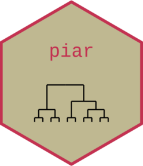

<!-- README.md is generated from README.Rmd. Please edit that file. -->

```{r, include = FALSE}
knitr::opts_chunk$set(
  collapse = TRUE,
  comment = "#>",
  out.width = "100%"
)
```

# Price Index Aggregation in R <a href="https://marberts.github.io/piar/"></a>

<!-- badges: start -->
[](https://cran.r-project.org/package=piar)
[](https://marberts.r-universe.dev)
[](https://github.com/marberts/piar/actions)
[](https://app.codecov.io/gh/marberts/piar)
[](https://zenodo.org/doi/10.5281/zenodo.10110046)
[](http://www.awesomeofficialstatistics.org)
<!-- badges: end -->

Most price indexes are made with a two-step procedure, where period-over-period *elemental indexes* are first calculated for a collection of *elemental aggregates* at each point in time, and then aggregated according to a *price index aggregation structure*. These indexes can then be chained together to form a time series that gives the evolution of prices with respect to a fixed base period. This package contains a collections of functions that revolve around this work flow, making it easy to build standard price indexes, and implement the methods described by Balk (2008), von der Lippe (2001), and the CPI manual (2020) for bilateral price indexes.

## Installation

Get the stable version from CRAN.

```{r, eval=FALSE}
install.packages("piar")
```

The development version can be installed from R-Universe

```{r, eval=FALSE}
install.packages("piar", repos = c("https://marberts.r-universe.dev", "https://cloud.r-project.org"))
```

or directly from Github.

```{r, eval=FALSE}
pak::pak("marberts/piar")
```

## Usage

There is a detailed vignette showing how to use **piar**: `browseVignettes("piar")`. But the basic work flow is fairly simple. 

The starting point is to make period-over-period elemental price indexes with the `elemental_index()` function and an aggregation structure with the `aggregation_structure()` function. The `aggregate()` method can then be used to aggregate the elemental indexes according to the aggregation structure. There are a variety of methods to work with these index objects, including chaining them over time.

```{r}
library(piar)

# Make Jevons business-level elemental indexes

head(ms_prices)

elementals <- with(
  ms_prices, 
  elemental_index(
    price_relative(price, period, product), 
    period, business, na.rm = TRUE
  )
)

# Make an aggregation structure from businesses to higher-level
# industrial classifications

head(ms_weights)

pias <- with(
  ms_weights,
  aggregation_structure(
    c(expand_classification(classification), list(business)),
    weight
  )
)

# Aggregate elemental indexes with an arithmetic index

index <- aggregate(elementals, pias, na.rm = TRUE)

# Chain them to get a time series

chain(index)
```

## References

Balk, B. M. (2008). *Price and Quantity Index Numbers*. Cambridge University Press.

Chiru, R., Huang, N., Lequain, M. Smith, P., and Wright, A. (2015). *The Canadian Consumer Price Index Reference Paper*, Statistics Canada catalogue 62-553-X. Statistics Canada.

ILO, IMF, OECD, Eurostat, UN, and World Bank. (2020). *Consumer Price Index Manual: Theory and Practice*. International Monetary Fund.

von der Lippe, P. (2001). *Chain Indices: A Study in Price Index Theory*, Spectrum of Federal Statistics vol. 16. Federal Statistical Office, Wiesbaden.